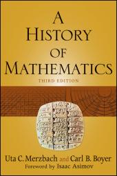

# My personal notes from Numerical Methods I (CAP 418)

*Last edited: 2024-02-20*

This repository contains my work, personal notes and notebook for this course at [INPE](http://www.inpe.br/posgraduacao/) .

# Course summary

- [Electronic-digital computer](https://en.wikipedia.org/wiki/Digital_electronic_computer)
- [Representation of numerical systems and error](https://en.wikipedia.org/wiki/Round-off_error)
- [Polynomial interpolation](https://en.wikipedia.org/wiki/Polynomial_interpolation)
- [Solution of linear equations](https://en.wikipedia.org/wiki/Linear_equation) (scalar)
- Matrices and [systems of linear equations](https://en.wikipedia.org/wiki/System_of_linear_equations)
- [Zeros of non-linear functions](https://en.wikipedia.org/wiki/Root-finding_algorithms)
- [Numerical differentiation](https://en.wikipedia.org/wiki/Numerical_differentiation) and [integration](https://en.wikipedia.org/wiki/Numerical_integration)
- [Numerical solution of differential equations](https://en.wikipedia.org/wiki/Numerical_methods_for_ordinary_differential_equations) and [systems of differential equations](https://en.wikipedia.org/wiki/System_of_differential_equations)
- [Fourier series and transform](https://en.wikipedia.org/wiki/Fourier_transform)
- Notions of [stochastic differential equations](https://en.wikipedia.org/wiki/Stochastic_differential_equation)

# Works

The works are in Jupyter Notebook format and use the Python environment. Jupyter Notebooks can be edited and run using [JupyterLab](https://github.com/jupyterlab/jupyterlab-desktop) or [Google Colab](https://colab.research.google.com/), and to run the cells with code in some cases it may be necessary to install additional libraries to the Python environment. For convenience, links (badges) are provided to open the Notebook in Colab.

- Performance comparison of three methods for solving zeros of functions

  - [**hands-on-01-bisection.ipynb**](hands-on-01-bisection.ipynb)  : the bisection method reduces the interval by half, until it becomes small enough. It is not the fastest method to calculate roots, but it is the most reliable, since bisection will always find the root from the given interval
  - [**hands-on-01-secant.ipynb**](hands-on-01-secant.ipynb)  : in the secant method, the function f(x) is assumed to be approximately linear near the root, and then the next estimated value to find the root can be calculated by linear interpolation
  - [**hands-on-01-raphson.ipynb**](hands-on-01-raphson.ipynb)  : the Newton-Raphson method is simple and fast, but has the disadvantage of needing the derivative 𝑓(𝑥) of the function. This implementation uses the [SymPy](https://www.sympy.org/en/index.html) library to solve the derivatives of functions, and also to find the result of the function, given the value of the variable
  - [**hands-on-01-comparison.ipynb**](hands-on-01-comparison.ipynb)  : comparison of the 3 previous methods, showing the execution time and the number of iterations

- Laplace transform

  - [**hands-on-02-laplace.ipynb**](hands-on-02-laplace.ipynb)  : is an integral transform that converts a function of a real variable, usually 𝑡 in the time domain, to a function of a complex variable 𝑠 in the complex frequency domain. The implementation uses the Sympy library

- Curve fitting

  - [**hands-on-03-ols.ipynb**](hands-on-03-ols.ipynb)  : the least squares method is an approach to regression analysis to bring the solution of equation systems closer, minimizing the sum of the squares of the waste made in the results of each individual equation
  - [**hands-on-03-mlr.ipynb**](hands-on-03-mlr.ipynb)  : Multiple Linear Regression is a statistical technique that models the linear relationship between explanatory variables (independent) and response variables (dependent). It is an extension of OLS
  - [**hands-on-03-galaxy.ipynb**](hands-on-03-galaxy.ipynb)  : investigation of the relationship between the properties of galaxies using the statistical technique of linear regression

- Piecewise Cubic Hermite Interpolating Polynomial (PCHIP)

  - [**pchip-quadrature-burgers.ipynb**](pchip-quadrature-burgers.ipynb)  : study of the PCHIP interpolation method, using as toy problem the 1D Burgers equation
  - [**pinn-quadrature-burgers.ipynb**](pinn-quadrature-burgers.ipynb)  : the idea of this Notebook is to be a complement to the previous one, using PINN as if it were an interpolator. The GHQ is the same used in the previous work, in order to be able to compare the results
  - [**pchip-impl-numpy.ipynb**](pinn-quadrature-burgers.ipynb)  : the idea of this Notebook is to compare the implementation of PCHIP in Python and Numpy, made by Taylor-Virbel, with the implementation of the SciPy library. The points to be interpolated are created using Burkardt's Gauss-Hermite Quadrature (GHQ) model that were generated in Notebook pchip-quadrature-burgers.ipynb

- Number base conversion

  - [**hands-on-B01-conv.ipynb**](hands-on-B01-conv.ipynb)  : converting from any base to any base without going through base 10

- System of linear equations

  - [**hands-on-B02-system.ipynb**](hands-on-B02-system.ipynb)  : solution of a system of linear equations by the method of gaussian elimination

- Interpolation

  - [**hands-on-B03-interpol.ipynb**](hands-on-B03-interp.ipynb)  : approximation of a function using some methods of polynomial interpolation, linear systems, and Lagrange's formula

- ODE solving

  - [**hands-on-B04-euler.ipynb**](hands-on-B04-euler.ipynb)  : Euler's method, a numerical method for approximating solutions of first-order Initial Value Problems (IVP) used to solve ordinary differential equations (ODEs) with a given initial value
  - [**hands-on-B04-picard.ipynb**](hands-on-B04-picard.ipynb)  : the Picard's method generates a sequence of increasingly precise algebraic approximations of the specific exact solution of the first-order differential equation with initial value

- 2D Burgers equation - finite difference method

  - [**burgers-2d-sympy.ipynb**](burgers-2d-sympy.ipynb)  : [Bateman–Burgers equation](https://en.wikipedia.org/wiki/Burgers%27_equation) is a fundamental partial differential equation and convection–diffusion equation occurring in various areas of applied mathematics, such as fluid mechanics, nonlinear acoustics, gas dynamics, and traffic flow

# Directories in this repo

- **KiusalaasSourceCode** : original code downloaded from the book website [KIUSALAAS, 2013]
- **KiusalaasNotebooks** : Jupyter Notebooks based on [KIUSALAAS, 2013]
- **FMCarlos** : CARLOS, F. M. Exercise List. Computational Mathematics CAP-239. Numerical base conversion, linear systems, polynomial interpolation, numerical integration, numerical solution of differential equations. (in Portuguese)

# Gradient Pattern Analysis (GPA)

A geometric method for characterizing the geometric bilateral symmetry breaking of a set of regularly distributed symmetric vectors in a square lattice. For more information, please see:

- GRADIENT PATTERN ANALYSIS. In: Wikipedia. [S. l.: s. n.], 25 May 2016. Available at: <https://en.wikipedia.org/w/index.php?title=Gradient_pattern_analysis&oldid=721951482>. Accessed on: 4 Apr. 2023.
- ROSA, R. R.; CAMPOS, M. R.; RAMOS, F. M.; VIJAYKUMAR, N. L.; FUJIWARA, S.; SATO, T. Gradient pattern analysis of structural dynamics: application to molecular system relaxation. Brazilian Journal of Physics, vol. 33, no. 3, p. 605–610, Sep. 2003. DOI 10.1590/S0103-97332003000300023. Available at: <http://www.scielo.br/scielo.php?script=sci_arttext&pid=S0103-97332003000300023>. Accessed on: 4 Apr. 2023.
- ROSA, R. R.; KARLICKÝ, M.; VERONESE, T. B.; VIJAYKUMAR, N. L.; SAWANT, H. S.; BORGAZZI, A. I.; DANTAS, M. S.; BARBOSA, E. B. M.; SYCH, R. A.; MENDES, O. Gradient pattern analysis of short solar radio bursts. Advances in Space Research, vol. 42, no. 5, p. 844–851, Sep. 2008. DOI 10.1016/j.asr.2007.08.015. Available at: <https://linkinghub.elsevier.com/retrieve/pii/S0273117707009027>. Accessed on: 4 Apr. 2023.
- ROSA, R. R.; PONTES, J.; CHRISTOV, C. I.; RAMOS, F. M.; RODRIGUES_NETO, C.; REMPEL, E. L.; WALGRAEF, D. Gradient pattern analysis of Swift–Hohenberg dynamics: phase disorder characterization. Physica A: Statistical Mechanics and its Applications, vol. 283, no. 1, p. 156–159, 1 Aug. 2000. DOI 10.1016/S0378-4371(00)00144-8. Available at: <https://www.sciencedirect.com/science/article/pii/S0378437100001448>. Accessed on: 4 Apr. 2023.
- ROSA, R. R.; SHARMA, A. S.; VALDIVIA, J. A. Characterization of asymmetric fragmentation patterns in spatially extended systems. International Journal of Modern Physics C, vol. 10, no. 01, p. 147–163, Feb. 1999. DOI 10.1142/S0129183199000103. Available at: <https://www.worldscientific.com/doi/abs/10.1142/S0129183199000103>. Accessed on: 4 Apr. 2023.
- RUBENS. Gradient Pattern Analysis. [S. l.: s. n.], 14 Dec. 2022. Available at: <https://github.com/rsautter/GPA>. Accessed on: 4 Apr. 2023.
- SAUTER, R. A.; et al. Gradient Pattern Analysis of the Solar Active Region NOAA 11131. Presentation at WorCAP 2022. Available at: <https://youtu.be/AlXNYKDpMec?t=7090> (in Portuguese).

# References

To organize my references and library I use [Zotero](https://www.zotero.org/) and [Calibre](https://calibre-ebook.com/). In the following link are the main books in [OPDS](https://en.wikipedia.org/wiki/Open_Publication_Distribution_System) and HTML formats, generated from a Calibre library using [calibre2opds](https://wiki.mobileread .com/wiki /Main_Page ) (click on book images for more information):

- <https://efurlanm.github.io/418/allbooks/allbooks_Page_1.html>

And in the following link are all references in BibTeX format generated using Zotero:

- <https://github.com/efurlanm/418/blob/master/library.lib>

# Links of interest

- CHASNOV, J. [Differential Equations for Engineers](https://youtu.be/Rbf83OyBzSY)
- MEI, W. [Original Codes from Numerical Methods in Engineering with Python](https://github.com/nickcafferry/Original-Codes-from-Numerical-Methods-in-Engineering-with-Python-3)
- QUESADA, P. C. M. [Notebooks generated from: Numerical Methods in Engineering with Python](https://personales.unican.es/corcuerp/python/codigo/index_nb_kiusalaas.html)
- PAUL'S ONLINE NOTES. [Systems of Differential Equations](https://tutorial.math.lamar.edu/Classes/DE/SystemsDE.aspx)
- BERKLEY, U. C. [Python Programming And Numerical Methods: A Guide For Engineers And Scientists](https://pythonnumericalmethods.berkeley.edu/notebooks/Index.html)
- MPMATH. [Numerical inverse Laplace transform](https://www.mpmath.org/doc/1.0.0/calculus/inverselaplace.html)
- INTMATH. [Applications of Laplace Transforms](https://www.intmath.com/laplace-transformation/10-applications.php)
- WIKIPEDIA.
  - [Gradient pattern analysis](https://en.wikipedia.org/wiki/Gradient_pattern_analysis)
  - [Laplace transform](https://en.wikipedia.org/wiki/Laplace_transform)
  - [Curve Fitting](https://en.wikipedia.org/wiki/Curve_fitting)
- SANTOS, L. [Numerical Methods 2021](https://www.youtube.com/@santoslblx) (Youtube channel)
  - [Linear Systems - provocations](https://youtu.be/nkGwpeFhg5c) (in Portuguese)
  - [Interpolation - provocations](https://youtu.be/SDTUMG-vz1M) (in Portuguese)
- NIETTO, S.; MARTINS, R. M. [Derivando a Matemática. Sistemas de Equações](http://www.ime.unicamp.br/~apmat/sistemas-lineares-algumas-aplicacoes/) (in Portuguese)
- SANTOS, F. M. Computational Mathematics CAP-239
  - [Exercise List](https://fmenino-cap-239.netlify.app/) (in Portuguese)
  - [Github repo](https://github.com/M3nin0/matematica-computacional) (in Portuguese)
- PASCUAL, C. [Tutorial: Understanding Regression Error Metrics in Python](https://www.dataquest.io/blog/understanding-regression-error-metrics/)
- W3Schools. [Machine Learning - Multiple Regression](https://www.w3schools.com/python/python_ml_multiple_regression.asp)
- YADAV, H. [Multiple Linear Regression Implementation in Python](https://medium.com/machine-learning-with-python/multiple-linear-regression-implementation-in-python-2de9b303fc0c)
- MatwWorks. [Piecewise Cubic Hermite Interpolating Polynomial (PCHIP)](https://www.mathworks.com/help/matlab/ref/pchip.html)
- SciPy. [PCHIP 1-D monotonic cubic interpolation](https://docs.scipy.org/doc/scipy/reference/generated/scipy.interpolate.PchipInterpolator.html#scipy.interpolate.PchipInterpolator)

# JupyterLab

There are some ways to view or edit the IPYNB (Jupyter Notebook) files, offline. One way is using the JupyterLab app:

<https://www.youtube.com/results?search_query=jupyterlab+desktop>

# Special mention

Boyer, C. B., & Merzbach, U. C. (2011). [A History of Mathematics](https://books.google.com.br/books?id=bR9HAAAAQBAJ) (Vol. 1). John Wiley & Sons.

The book is a very interesting chronicle of the thousands of years of history of mathematics, from the Greeks to Gödel, and traces the development of European mathematics and the contributions of Chinese, Indian, and Arab civilizations. It is worth reading.
