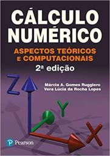
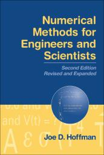
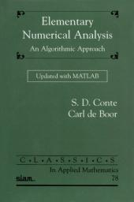

# My personal CAP418 course repository

This repository contains my work for this [course at INPE](http://www.inpe.br/posgraduacao/).

# Course summary

Electronic-digital computer. Representation of numerical systems and error. Polynomial interpolation. Solution of linear equations (scalar). Matrices and systems of linear equations. Zeros of non-linear functions. Numerical differentiation and integration. Numerical solution of differential equations and systems of differential equations. Fourier series and transform. Notions of stochastic differential equations.

# References

&emsp;
&emsp;
&emsp;
&emsp;

- RUGGIERO, MAR.; LOPES, VLR. [Cálculo numérico aspectos teóricos e computacionais](https://www.google.com.br/books/edition/C%C3%A1lculo_num%C3%A9rico/kuRDAAAACAAJ). 2 ed, 1996. ISBN: 8534602042.
-  HOFFMAN, J. D. [Numerical Methods for Engineers and Scientists](https://www.google.com.br/books/edition/_/VKs7Afjkng4C). 2 ed, 2001. ISBN 0824704436.
- CONTE, SD.; DE BOOR, C. [Elementary Numerical Analysis: an algorithm approach](https://books.google.com.br/books?id=oYZXDwAAQBAJ). 3 ed, 2018. ISBN	1611975204, 9781611975208.
- PROAKIS, JG.; MANOLAKIS DG. [Digital Signal Processing](https://books.google.com.br/books?id=ZoISngEACAAJ). 4 ed, 2013. ISBN 1292025735, 9781292025735.